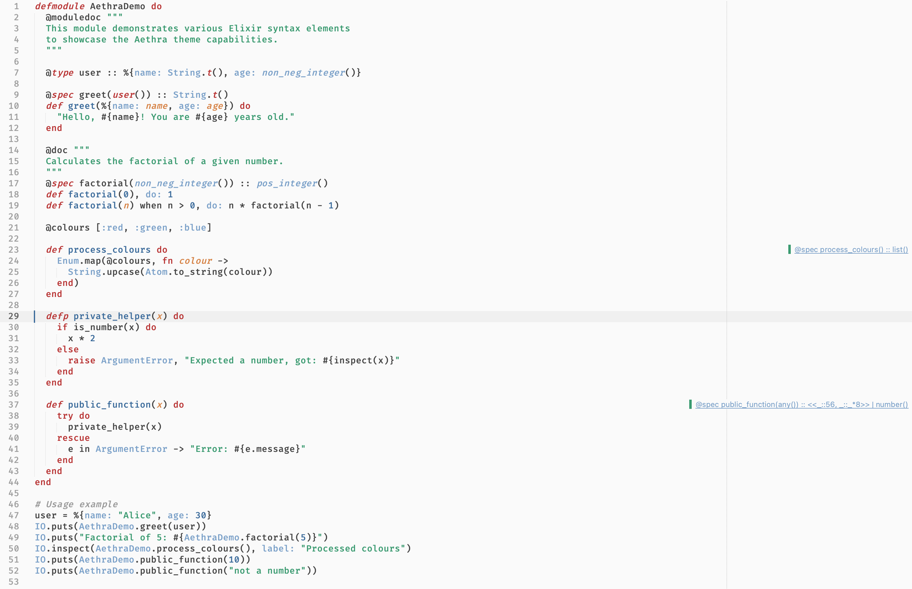
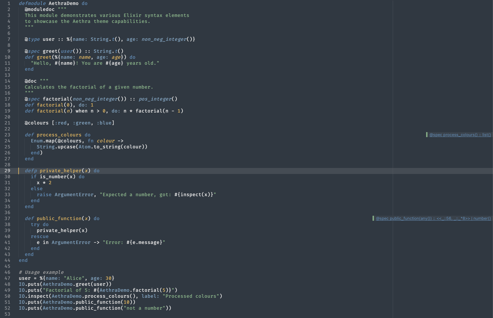

# Aethra Color Scheme for Sublime Text

Aethra is a carefully crafted color scheme for Sublime Text that comes in two flavors: Light and Dark.
It's designed to enhance code readability and provide a pleasant coding experience for both daytime and nighttime coding sessions.

## Features

- **Dual Color Scheme**: Switch between Aethra Light and Aethra Dark to suit your preference or environment.
- **Optimized for Readability**: Carefully chosen colors to reduce eye strain and improve code comprehension.
- **Language Support**: Enhanced syntax highlighting for a wide range of programming languages especially Elixir.
- **Easy on the Eyes**: Balanced contrast ratios for comfortable long coding sessions.

## Installation

To install it, use Package Control.

## Usage

After installation, you can select the Aethra Color Scheme:

1. Go to `Preferences > Color Scheme`
2. Choose either `Aethra Light` or `Aethra Dark`

## Preview

Here's a sample Elixir code to showcase the Aethra Color Scheme:

### Light:

### Dark:

## Customization

Feel free to customize the color scheme to your liking. You can modify the `.sublime-color-scheme` files using Sublime Text's color scheme editor.

## Contributing

Contributions are welcome! If you have any suggestions or improvements, please open an issue or submit a pull request.

## License

This color scheme is released under the MIT License. See the [LICENSE](LICENSE) file for details.

## Acknowledgements

Aethra Color Scheme was created by [Pavel Vlasikhin](https://www.vlasikhin.com/). Special thanks to the Sublime Text community for inspiration and support.

Enjoy coding with Aethra!
